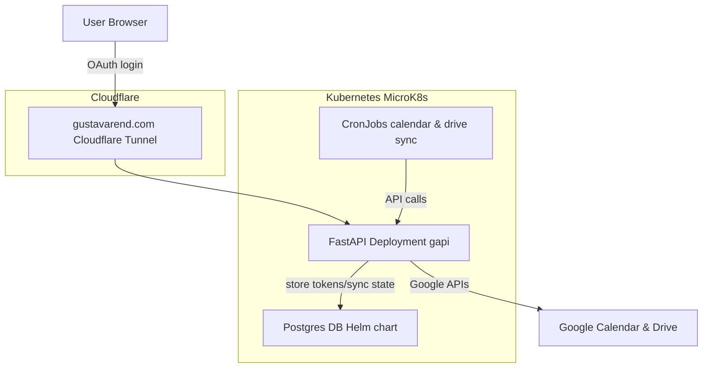

# Projekt: Google Calendar & Drive API med Kubernetes, Terraform & Cloudflare Tunnel

**Emner:** Cloud Computing & DevOps · Automatisering & Scripting

---

## Hvorfor dette projekt?  
Jeg ville forbinde et custom API med Google Calendar og Google Drive, så vores system kan:  
- **Synkronisere begivenheder** fra Google Calendar.  
- **Spejle filer** fra en Google Drive mappe.  
- Gemme tokens og sync-state i en database.  

Dette binder direkte ind i mine emner:  
- **Cloud Computing & DevOps**: Kubernetes (MicroK8s), Terraform, Helm, Cloudflare Tunnel, Postgres i container.  
- **Scripting & Automation**: FastAPI, OAuth-flow, automatiserede CronJobs til sync, Ansible til server bootstrap.

---

## Arkitektur





---

## Trin-for-trin opsætning

### 1. Server (Ansible bootstrap)
- Ubuntu Server (på min gamle MacBook Pro).  
- Installerede MicroK8s, åbnede porte, satte firewall.  
- Playbook eksempel:

  ```
  - hosts: myserver
    become: true
    tasks:
      - name: Install microk8s
	    snap: name=microk8s classic=yes state=present
      - name: Enable addons
        command: microk8s enable dns registry ingress
  ```

### 2. Infrastruktur (Terraform)
- **Postgres** via Helm (Bitnami chart).  
- **FastAPI Deployment** med Secrets (client_id, secret, redirect_uri).  
- **Service** som NodePort.  
- **Ingress** (først `myapi.local`, senere flyttet til Cloudflare Tunnel).  

### 3. API (FastAPI)
- Implementerede endpoints:
  - `/oauth2/start` → Google login.  
  - `/oauth2/callback` → Henter access/refresh token, gemmer bruger i DB.  
  - `/api/calendar/sync` → Inkrementel sync m. `syncToken`.  
  - `/api/drive/sync` → Inkrementel sync m. `startPageToken`.  

- Gemmer alt i Postgres (`users`, `tokens`, `cal_state`, `drive_state`).

### 4. Cloudflare Tunnel
- Ingen port forwarding i router.  
- `cloudflared tunnel` peger `myapi.gustavarend.com` → NodePort på server.  
- Gratis TLS fra Cloudflare.  
- Google accepterer redirect URI:  
```
  https://myapi.gustavarend.com/oauth2/callback
  ```

### 5. Automatisering
- Kubernetes **CronJobs** rammer sync-endpoints hvert 5.-7. minut.  
- Terraform sikrer reproducérbar infra.  
- Ansible bootstrapper maskinen.  
- Docker builds versioneres (fx `gapi:0.4`).

---

## Læring & Relevans
- **Cloud Computing & DevOps**: Jeg fik erfaring med MicroK8s, Helm, Terraform, Ingress, Secrets, Cloudflare Tunnel.  
- **Scripting & Automation**: Jeg byggede hele OAuth-flowet selv, håndterede scopes, tokens, sync-state og cron jobs.  
- **Fejlsøgning**:  
  - Håndtering af redirect_uri fejl (`.local` vs. public domain).  
  - Secrets der var dobbelt-base64 encoded.  
  - Scopes (`email` → `userinfo.email`) som gav 500 errors.  
- **Best Practices**: Bruger CronJobs i stedet for manuelle kald, IaC til konsistens, og Cloudflare Tunnel for sikker adgang.

---

## Fremtidige forbedringer
- Bedre logging/observability (Prometheus/Grafana).  
- Webhooks (push) i stedet for polling til sync.  
- CI/CD pipeline (GitHub Actions → bygger Docker og deployer med Terraform).  
- Flere brugere i DB + multi-tenant håndtering.

---

## Konklusion
Projektet viser hvordan man kan kombinere **et moderne cloud-setup** (Kubernetes, Terraform, Cloudflare) med **scripting** (FastAPI, Python, OAuth) for at bygge en realistisk integration mellem interne systemer og Google’s API’er.  

Det er både en teknisk proof-of-concept og et konkret eksempel på **Cloud Computing & DevOps + Automatisering & Scripting** i praksis.  