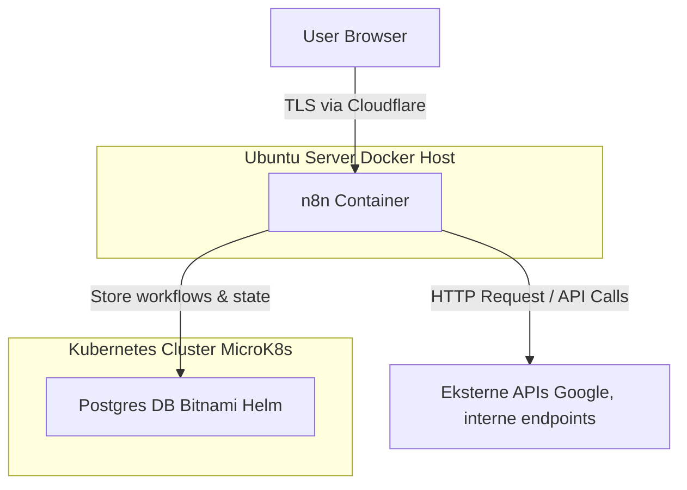

# Projekt: n8n Workflow Automation med Docker, PostgreSQL & Kubernetes-integration

**Emner:** Cloud Computing & DevOps · Automatisering & Scripting  

---

## Hvorfor dette projekt?  
Jeg ville have en fleksibel **automatiseringsplatform** til at forbinde systemer som Google Calendar, API’er og interne services.  
- **n8n** giver mulighed for at bygge workflows visuelt.  
- Kører **self-hosted** på min egen infrastruktur.  
- Bruger **PostgreSQL** som backend-database for persistens.  

Dette passer ind i mine emner:  
- **Cloud Computing & DevOps**: Docker Compose, PostgreSQL i Kubernetes, Terraform Helm chart til DB.  
- **Scripting & Automation**: Workflows i n8n, API-kald, command execution nodes.

---

## Arkitektur





---

## Trin-for-trin opsætning

### 1. Database (Postgres i Kubernetes)
- Deployet via **Terraform Helm release** (Bitnami chart).  
- Oprettede separat bruger + database (`n8n_user`, `n8ndb`).  
- Eksponerede DB med `NodePort` så Docker-container kan forbinde udefra.  

### 2. n8n Container (Docker Compose på Ubuntu)
- Bruger `docker.n8n.io/n8nio/n8n` image.  
- Miljøvariabler konfigureret:
  ```yaml
  environment:
    - DB_TYPE=postgresdb
    - DB_POSTGRESDB_HOST=192.168.0.74
    - DB_POSTGRESDB_PORT=30432
    - DB_POSTGRESDB_DATABASE=n8ndb
    - DB_POSTGRESDB_USER=
    - DB_POSTGRESDB_PASSWORD=
    - N8N_BASIC_AUTH_ACTIVE=true
    - N8N_BASIC_AUTH_USER=
    - N8N_BASIC_AUTH_PASSWORD=
    - N8N_SECURE_COOKIE=false
  ```

### 3. Adgang & sikkerhed
- Først testet via `http://192.168.0.74:5678`.  
- Til produktion skal det køre bag **Cloudflare Tunnel** med TLS.  
- Basic Auth aktiveret for sikkerhed på LAN.  

### 4. Workflows i n8n
- **HTTP Request node** til API-kald (fx `POST /api/calendar/sync?user_id=1`).  
- **Execute Command node** krævede curl/wget, men løst ved at bruge HTTP Request node.  
- Bygget små automations for at synkronisere systemer.  

---

## Læring & Relevans
- **Cloud Computing & DevOps**: Jeg fik n8n til at spille sammen med Postgres i Kubernetes via NodePort.  
- **Automation**: Jeg begyndte at bygge rigtige workflows (API sync, kommando-kald).  
- **Fejlsøgning**:  
  - DNS fejl (`.svc.cluster.local` udenfor K8s).  
  - Postgres service var `ClusterIP` i stedet for `NodePort`.  
  - n8n krævede `N8N_SECURE_COOKIE=false` for HTTP-login.  

---

## Fremtidige forbedringer
- Reverse proxy med **TLS** (Cloudflare Tunnel + Ingress).  
- CI/CD pipeline til at bygge custom n8n image (fx med curl/wget installeret).  
- Monitoring (Prometheus/Grafana) af workflows.  
- Webhooks fra eksterne systemer i stedet for polling.  

---

## Konklusion
Projektet viser hvordan jeg kan hoste **n8n self-hosted** og koble det op mod en eksisterende **Kubernetes-Postgres** setup.  
Det er et konkret eksempel på hvordan **Cloud Computing & DevOps + Automation** spiller sammen i praksis: Docker til appen, Kubernetes til databasen, og n8n som workflow-motor til at forbinde API’er og systemer.  
