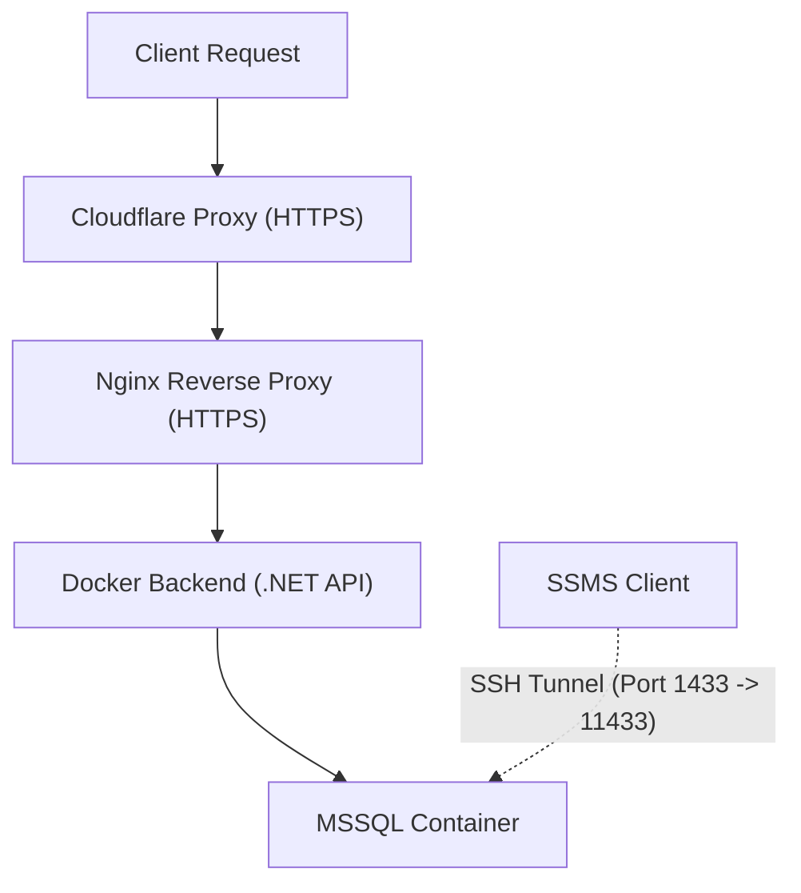

**Emner:** Cloud Computing & DevOps · Automatisering & Infrastruktur  

**Hvorfor disse emner?**  
Disse teknologier danner rygraden i moderne serverdrift. Ved at kombinere **Docker**, **Nginx** og **Cloudflare** kan man opnå en skalerbar, sikker og automatiseret webinfrastruktur, der understøtter både webapplikationer og databaser.  
I denne session blev der arbejdet med at containerisere en .NET backend og en MSSQL-database, opsætte Nginx som reverse proxy med HTTPS, og bruge Cloudflare til DNS og SSL-håndtering.

---

**Forhåndsviden:**  
- Grundlæggende forståelse af netværk, porte og DNS  
- Kendskab til Docker og container-kommunikation  
- Erfaring med Nginx-konfiguration og proxy begreber  
- Kendskab til Cloudflare’s DNS og SSL-indstillinger  

---

**Mål:**  

- Køre både backend og database i separate Docker-containere  
- Opsætte Nginx som reverse proxy med HTTPS  
- Bruge Cloudflare som DNS- og sikkerhedslag  
- Forstå forskellen mellem "Full" og "Full (Strict)" SSL-tilstande  
- Sikker adgang til database via SSH-tunnel i stedet for åbne porte  
- Konfigurere `ufw` firewall på VPS til kun nødvendige porte  

---

**Proces og læringspunkter:**  

1. **Opsætning af Docker-containere**  
   - Kørte SQL Server og .NET backend som separate containere.  
   - Eksponerede kun nødvendige porte (`8080` for backend, `1433` internt).  
   - Bekræftede kørende services via `docker ps`.

   ```bash
   docker run -d --name mssql \
     -e "ACCEPT_EULA=Y" \
     -e "SA_PASSWORD=<PasswordHere>" \
     -p 1433:1433 \
     mcr.microsoft.com/mssql/server:2022-latest
```

2. **Nginx som reverse proxy**
- Tilføjede en Nginx-container, der håndterer trafik på port 80.
- Proxyede trafik til backend-containeren:

```
# Redirect HTTP -> HTTPS
server {
  listen 80;
  server_name gustavarend.com www.gustavarend.com lms.gustavarend.com;
  return 301 https://$host$request_uri;
}

# Serve HTTPS content
server {
  listen 443 ssl;
  server_name gustavarend.com www.gustavarend.com lms.gustavarend.com;
  
  ssl_certificate /etc/ssl/private/fullchain.pem;
  ssl_certificate_key /etc/ssl/private/privkey.pem;

  location / {
    proxy_pass http://lms-backend:8080;
    proxy_set_header Host $host;
    proxy_set_header X-Real-IP $remote_addr;
    proxy_set_header X-Forwarded-For $proxy_add_x_forwarded_for;
    proxy_set_header X-Forwarded-Proto $scheme;
  }
}
```

3. **Cloudflare-integration**
- Pegede domænet `lms.gustavarend.com` mod Cloudflare’s navneservere.
- Oprettede et **A-record** mod VPS’ens IP (proxyed)

4. **Sikkerhedsforanstaltninger**

- Åbnede kun porte 22 (SSH), 80, 422 i `ufw`.
- Lukkede port 1433 eksternt for MSSQL.
- Etablerede SSH-tunnel til database for SSMS-adgang:
  ```
    ssh -L 11433:localhost:1433 administrator@vps-2654.onecom-cloud.one
    ```
- og tilslutning i SSMS:


5. **Resultat**
- Stabil, sikker og Cloudflare-beskyttet applikation.
- Al trafik kører krypteret via HTTPS med reverse proxy.
- Database utilgængelig udefra, men stadig tilgængelig via tunnel.
- En let reproducerbar opsætning via Docker og versionskontrol.




