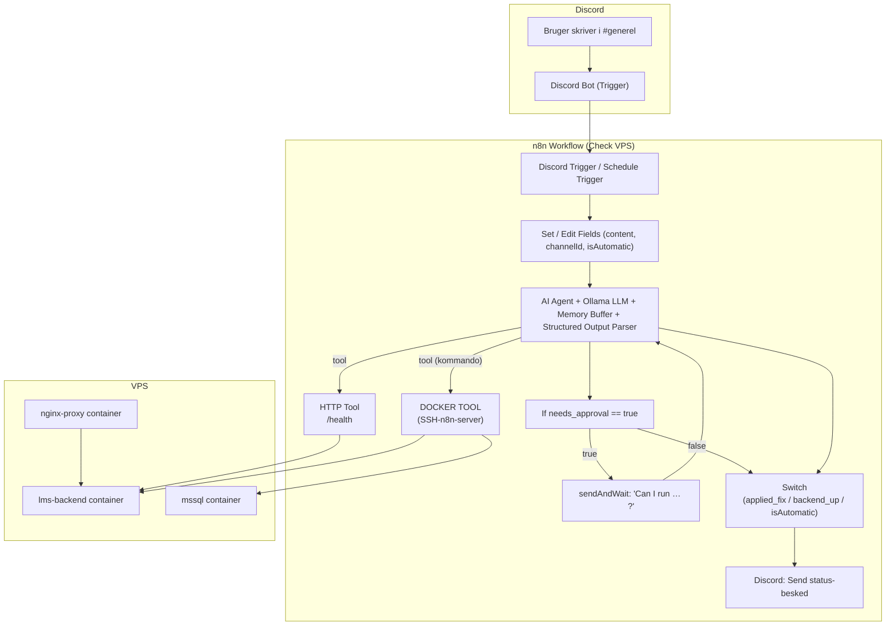

**Emner:** Cloud Computing & DevOps · Automatisering & Infrastruktur · AI-agenter & n8n  

**Hvorfor disse emner?**  
Efter at have containeriseret backend, database og Nginx på en VPS, opstod næste naturlige skridt:  
Hvordan kan jeg *automatiseret* holde øje med, om backenden faktisk kører – og samtidig beholde **menneskelig kontrol**, før der køres potentielt farlige kommandoer på serveren?

Her kombinerer jeg:

- **n8n** som orkestreringsmotor  
- **Discord** som brugerinterface (chat med min “ops-bot”)  
- **AI Agent-node i n8n** (LangChain) med en lokal LLM via Ollama  
- **SSH/Docker-kommandoer** og et HTTP health-endpoint  

Alt dette samles i workflowet **“Check VPS”**, hvor en AI-agent hjælper med at vurdere, om backenden er oppe – og foreslår kommandolinje-fixes, der først eksekveres efter eksplicit godkendelse på Discord.  

---

**Forhåndsviden:**  

- Grundlæggende kendskab til:
  - Docker-containere og `docker ps` / `docker logs`
  - SSH-adgang til en VPS
  - n8n-workflows (nodes, forbindelser, credentails)
  - Discord bots (bot-token, kanal-ID’er)
- Let kendskab til AI/LLM-begreber (prompt, systembeskeder, JSON-output)

---

**Mål:**  

- Kunne skrive til en Discord-kanal og spørge:  
  > “Er backenden oppe?”  
  og få et struktureret svar tilbage.
- Have et **automatisk health-check** (f.eks. hver time) via n8n’s Schedule Trigger.
- Lade en AI Agent analysere:
  - HTTP health endpoint (kører API’en?)  
  - Om Docker-containere som `lms-backend`, `mssql` og `nginx-proxy` kører  
- Sikre, at AI **aldrig** selv eksekverer farlige kommandoer, men:
  - Beskriver, hvad der bør køres
  - Beder om eksplicit godkendelse
  - Først derefter får lov til at kalde et SSH-underworkflow
- Eksperimentere med:
  - n8n’s AI Agent-node (LangChain Tools Agent)
  - Struktureret JSON-output med Output Parser
  - Lokal LLM via **Ollama** – og forstå dens begrænsninger ift. værktøjer (tools)

---

## 1. Overordnet use case: Min AI-ops på Discord

I stedet for at logge ind på VPS’en hver gang og skrive `docker ps`, ville jeg kunne skrive i Discord:

> ´er backenden oppe?`

Så skal workflowet gøre følgende:

1. Modtage beskeden via **Discord Trigger**.
2. Rense/ensrette input (via nogle `Set`-noder).
3. Give beskeden til en **AI Agent**, som:
   - Har en **system prompt** der definerer dens rolle
   - Ved, at der findes tre vigtige containere: `lms-backend`, `mssql`, `nginx-proxy`
   - Har adgang til:
     - Et **HTTP Request-tool** mod `https://lms.gustavarend.com/health`
     - Et **DOCKER TOOL**, som er et *Tool Workflow* der kører kommandoer via SSH
   - Skal svare i et **fast JSON-format**, der fortæller:
     - Om backenden er oppe
     - Hvilke kommandoer der eventuelt ønskes kørt
     - Om der er brug for godkendelse
4. På baggrund af JSON-svaret:
   - Evt. spørge på Discord:  
     > “Må jeg køre: docker ps … ?”
   - Ved godkendelse → køre SSH-workflowet
   - Til sidst sende et pænt status-svar tilbage i Discord.

---

## 2. Triggere: Discord + Schedule

Workflowet “Check VPS” har to måder at starte på:  

### 2.1. Discord Trigger – manuel chat

```json
{
  "type": "n8n-nodes-discord-trigger.discordTrigger",
  "parameters": {
    "guildIds": ["1438516297464942614"],
    "channelIds": ["1438516298215587872"],
    "pattern": "every",
    "additionalFields": {
      "externalBotTrigger": true
    }
  }
}
```

- Lytter på en bestemt Discord-kanal.
- `pattern: "every"` betyder, at beskeder, der matcher mønsteret (fx starter med “every”), triggere workflowet.
- En `Set`-node (“Edit Fields1” + “Edit Fields2”) bruges til at forme input-data til AI Agenten, bl.a. felter som:
  - `content` (selve beskeden)
  - `channelId` (så vi ved, hvor vi skal svare)
  - `isAutomatic` (om det er bruger-initieret eller et cron-check)

### 2.2. Schedule Trigger – automatisk health-check

En separat **Schedule Trigger** kører f.eks. hver time:

```json
{
  "type": "n8n-nodes-base.scheduleTrigger",
  "parameters": {
    "rule": {
      "interval": [{ "field": "hours" }]
    }
  }
}
```

Derefter en `Set`-node (“Edit Fields”) som genererer et input i rå JSON-mode:

```json
{
  "content": "is bacend running?",
  "channelId": "123456",
  "isAutomatic": "true"
}
```

Det gør, at AI Agenten behandles på samme måde, uanset om checket er manuelt eller automatisk – men vi kan reagere forskelligt senere afhængigt af `isAutomatic`.

---

## 3. AI Agent: system prompt, værktøjer og JSON-output

Kernen i workflowet er **AI Agent**-noden:  

```json
{
  "type": "@n8n/n8n-nodes-langchain.agent",
  "name": "AI Agent",
  "parameters": {
    "promptType": "define",
    "text": "={{ $json.content }}",
    "hasOutputParser": true,
    "options": {
      "systemMessage": "You are a new IT Administrator for me. 
Your sole responsibility is to ensure the backend is operational.

CRITICAL PERMISSION RULES:
- You MUST request EXPLICIT APPROVAL before running ANY command that could modify the system
- This includes but is not limited to: docker start, docker stop, docker run, docker rm, kill, pkill, systemctl, or any command that creates, modifies, or deletes files
- Even diagnostic commands like docker ps, netstat, or ps are fine without permission
- When in doubt, ASK FIRST

You are a Docker expert. You know everything about Docker and common issues that prevent containers from running properly. In our environment, we have our backend, db and nginx running inside a Docker container called "lms-backend", "mssql" and "nginx-proxy".

IMPORTANT!
These 3 container must run! If just one is down, the backend will fail!

When asked if the backend is up, follow these systematic troubleshooting steps:

1. First, check if the website is accessible and database is ok using the HTTP tool.

2. If the  system or database is down, investigate systematically:
   - Check if the containers exists and its current state
   - Check what's currently using port 
   - Look for any error messages or logs
   - Identify the root cause before attempting any fix

3. Once you've identified the issue, explain what you found and request permission for the specific fix needed

4. Only after receiving explicit approval, apply the necessary fix to restore the website

Remember: Always investigate thoroughly before proposing solutions. Something else might be using the port.

REQUIRED OUTPUT FORMAT:
You MUST always respond with a JSON object in this exact format:
{
    "backend_up": true/false,
    "message": "Detailed explanation of status and any actions taken",
    "applied_fix": true/false,
    "needs_approval": true/false,
    "commands_requested": "Specific commands needing approval (null if none)"
}"
    }
  }
}
```

Her sker der flere vigtige ting:

- **Rolle:** AI er defineret som en *ops-ingeniør* med fokus på backendens sundhed.
- **Sikkerhedsregler:**  
  - Må **ikke** selv køre ændrende kommandoer uden godkendelse.  
  - Må gerne lave diagnostik (f.eks. `docker ps`) – men i praksis vælger jeg stadig at lade alt gå via approval-flowet.
- **Konkrete containere:** `lms-backend`, `mssql`, `nginx-proxy` er nævnt ved navn.
- **Trinvis diagnose:** Først health-check via HTTP, derefter evt. Docker/port-undersøgelse.
- **Struktureret JSON-output:**  
  AI *skal* altid returnere et objekt med felter:
  - `backend_up` (bool)
  - `message` (string)
  - `applied_fix` (bool)
  - `needs_approval` (bool)
  - `commands_requested` (string eller null)

For at håndhæve dette format bruges en **Structured Output Parser**-node, der er tilknyttet AI Agenten. Den har et manuelt schema:

```json
{
  "backend_up": "boolean",
  "message": "string",
  "applied_fix": "boolean",
  "needs_approval": "boolean",
  "commands_requested": "string"
}
```

Det gør AI’en markant mere stabil og maskinvenlig – i stedet for uforudsigelig tekst.

---

## 4. Lokal LLM via Ollama

Som sprogmodel bruger workflowet en **Ollama Chat-node**:  

```json
{
  "type": "@n8n/n8n-nodes-langchain.lmChatOllama",
  "name": "Ollama",
  "parameters": {
    "model": "gpt-oss:20b"
  }
}
```

Den er forbundet til AI Agenten som `ai_languageModel`.

I praksis viste det sig, at:

- Ollama er fin til:
  - Natural language → struktureret JSON (når man er meget streng i prompten)
  - Forklaring og fejlsøgning
- Men nogle modeller har begrænsninger ift. n8n’s **“Tools Agent”**-funktionalitet:
  - Den understøtter ikke alle de officielle “function calling”/tool-protokoller, som OpenAI/Mistral gør.
  - n8n’s Agent-node kan godt *deklarere* værktøjer, men modellen bruger dem ikke altid lige stabilt.

Derfor er strategien her:

- HTTP health-check bruges som et *simpelt tool*, som modellen kan kalde.
- For Docker/SSH-kommander er det **mennesket** der i sidste ende godkender – og det er n8n, der kører kommandoen.

---

## 5. DOCKER TOOL: Tool Workflow til SSH på VPS

For at adskille “tænke” og “gøre” lader jeg AI Agenten foreslå kommandoer, men selve eksekveringen ligger i et separat workflow: **“SSH-n8n-server”**.

Det kobles på via en **Tool Workflow-node** kaldet `DOCKER TOOL`:  

```json
{
  "type": "@n8n/n8n-nodes-langchain.toolWorkflow",
  "name": "DOCKER TOOL",
  "parameters": {
    "workflowId": "t3YOHco3e6N0DBoJ",
    "workflowInputs": {
      "mappingMode": "defineBelow",
      "value": {
        "command": "={{ /*n8n-auto-generated-fromAI-override*/ $fromAI('command', ``, 'string') }}"
      },
      "schema": [
        {
          "id": "command",
          "type": "string"
        }
      ]
    }
  }
}
```

- `workflowId` peger på under-workflowet, der kører SSH-kommandoen.
- `command`-feltet kommer fra `$fromAI('command', ...)` – dvs. Agenten kan foreslå fx:

  ```json
  {
    "command": "docker ps --format "{{.Names}} {{.Status}}""
  }
  ```

Underworkflowet **SSH-n8n-server** kan f.eks. bestå af:

- En `Execute Command`-node (SSH) med:
  - Host: VPS’ens IP
  - Bruger: root, så det er vigtigt at jeg personligt godkender kommandoer
  - Kommando: `={{ $json.command }}`

På den måde bliver `DOCKER TOOL` et sikkert “gateway”-lag:
- AI’en bestemmer kommandoen
- n8n definerer grænserne (SSH-bruger, key, netværk)
- Mennesket godkender i midten (se næste afsnit)

---

## 6. Godkendelsesflow og Discord-svar

Når AI Agenten har returneret sit JSON-svar, bruger workflowet en kombination af `If` og `Switch`-noder til at styre, hvad der sker:  

### 6.1. If-node: Har brug for godkendelse?

`If3`-noden tjekker:

```json
leftValue: "={{ $json.output.needs_approval }}",
operator: "true"
```

- **Hvis `needs_approval == true`:**  
  → vi går i en “approval path”.
- **Ellers:**  
  → vi går direkte til et `Switch`, der afgør, hvilken besked der skal sendes.

### 6.2. Discord: Spørg om lov til at køre kommando

`Create a channel` (navnet er misvisende – det sender faktisk bare en besked) skriver til Discord:  

```text
{{ $('AI Agent').item.json.output.message }}

Can i run: {{ $json.output.commands_requested }}
```

Node-typen er `discord` med `operation: sendAndWait`, så den kan vente på brugerens svar/reaktion.

En efterfølgende `Set`-node (“Edit Fields3”) omsætter svar-data til et simpelt JSON, som AI Agenten/flowet kan arbejde videre med:

```json
{
  "content": "{{ $json.data.approved }}",
  "channelId": "{{ $('Edit Fields2').item.json.channelId }}"
}
```

Her kunne `approved` f.eks. være `true`/`false` eller en tekstbesked.

### 6.3. Switch-node: vælg svarstrategi

`Switch`-noden indeholder tre regelsæt, bl.a.:

- Om der er blevet anvendt en fix (`output.applied_fix == true`)
- Om `backend_up == false`
- Om det er automatisk eller manuelt (`isAutomatic`)

Alt efter udfald sendes beskeden videre til en af tre Discord-noder:

- `Send a message1`
- `Send a message2`
- `Send a message`

De skriver alle en kombination af:

```text
{{ $json.output.message }}
Backend running: {{ $('AI Agent').item.json.output.backend_up }}
```

Så uanset hvad der sker, ender brugeren i Discord med:
- Et menneskeligt læsbart svar (forklaring)
- En klar boolean-status på om backenden er oppe

---

## 7. Erfaringer: AI Agent + lokale LLM’er (Ollama / LM Studio)

I denne proces dukkede der en række praktiske erfaringer op:

1. **AI Agent og tools er designet til modeller med “function calling”**  
   n8n’s AI Agent-node er bygget på LangChain’s Tools Agent. Den fungerer *bedst* med modeller som OpenAI, Groq, Mistral osv., hvor tools/funktioner kan registreres eksplicit.

2. **Ollama og LM Studio er “OpenAI-kompatible”, men ikke 1:1 på tools**  
   - De kan fint svare på prompts og producere JSON.  
   - Men den dybe integration med tools (automatiske tool calls, schema-validerede argumenter) virker ikke på alle AI modeller som i de officielle backends.  
   - Resultat:  
     - Man ser ofte beskeden  
       > “None of your tools were used in this run. Try giving your tools clearer names and descriptions…”  
     - eller modellen skriver noget, der *ligner* et tool call, men som i praksis bare er tekst.

3. **Løsning: Lad AI’en være “hjernen” – men lad n8n være “hænderne”**  
   I stedet for at insistere på fuld-automatisk tool-calling:

   - AI'en får en **streng JSON-kontrakt** (via Output Parser).
   - Feltet `commands_requested` bruges til at foreslå konkrete kommandoer.
   - n8n (og et menneske) beslutter, hvornår `DOCKER TOOL` (SSH-workflowet) skal bruges.
   - På sigt kan man altid skifte til en model med fuld tool-support, uden at ændre resten af workflowet.

4. **Struktureret output gør hele forskellen**  
   Uden det faste JSON-schema bliver det næsten umuligt at bygge stabile flows rundt om en LLM.  
   Med schemaet:

   ```json
   {
     "backend_up": true,
     "message": "...",
     "applied_fix": false,
     "needs_approval": true,
     "commands_requested": "docker ps ..."
   }
   ```

   er det pludselig let at route beslægtede scenarier i n8n.

---

## 8. Resultat

Med **“Check VPS”**-workflowet opnås:

- En **chat-baseret ops-oplevelse** i Discord:
  - AI kan forklare, hvad der er galt.
  - Brugeren kan godkende eller afvise foreslåede kommandoer.
- Et **automatisk overvågningslag** via Schedule Trigger:
  - Der tjekkes løbende, om `lms-backend`-miljøet ser sundt ud.
  - Eventuelle problemer kan fanges tidligt.
- En **tydelig adskillelse** mellem:
  - AI-logik (analyse, forslag, forklaring)
  - Infrastruktur-handling (SSH, docker, health-checks)
- En løsning, der spiller naturligt sammen med den tidligere opsætning af:
  - Containeriseret backend + MSSQL + Nginx
  - Cloudflare som DNS/SSL-lag  

---



